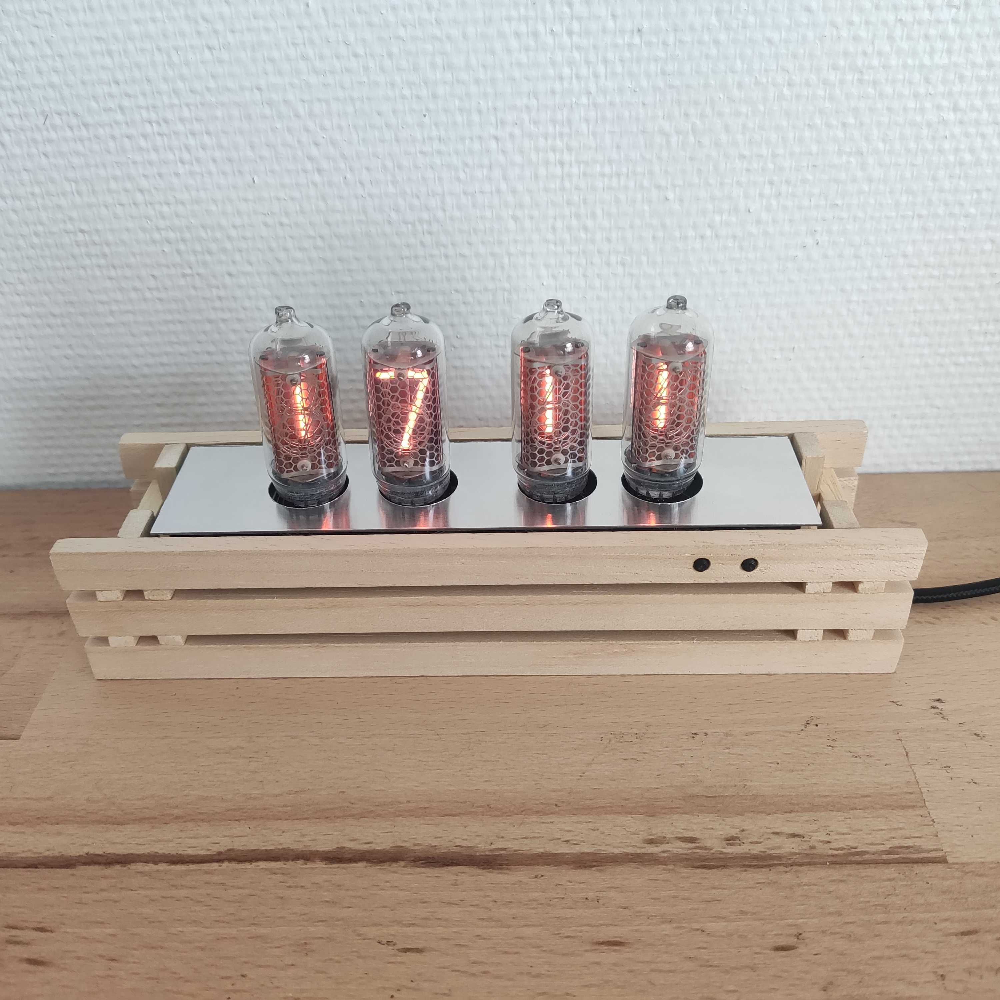
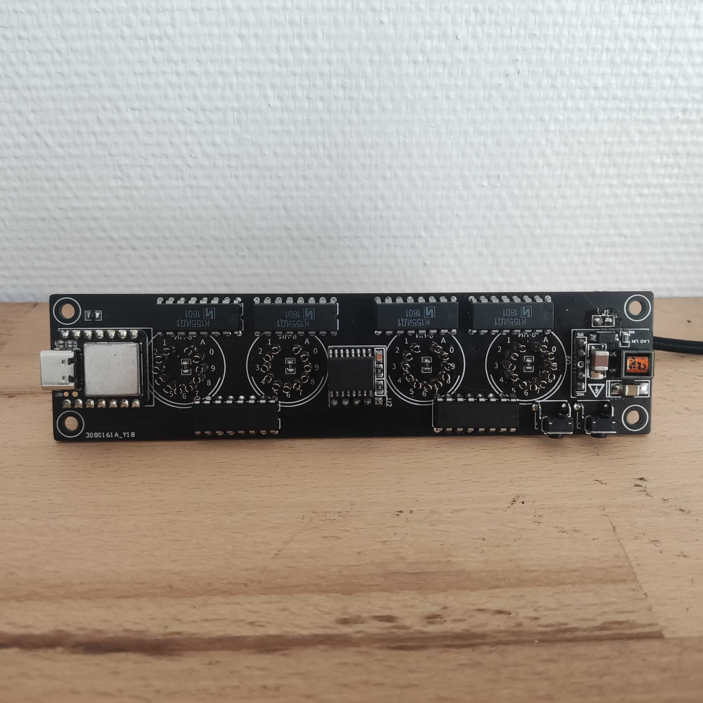
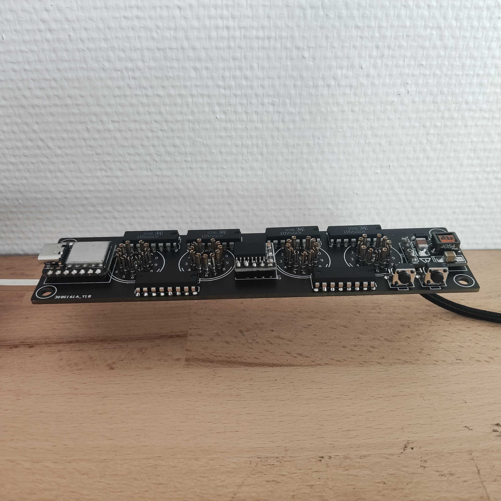

# Nixie-clock

Arduino based project for a custom Nixie clock made with four IN-8 tubes.

The clock has the followings functionalities / characteristics :

- Can be USB powered (working voltage : 5 V)
- Time can be edited easily
- The hours can be displayed in 12h or 24h format
- The leading zero on the hours can be hidden 
- Eco mode allows to turn off the tubes between an editable time period
- Bypass possibility of the eco mode for one period by pressing a button
- RTC allows to keep track of time when the clock is unpowered
- All settings are saved on a emulated EEPROM to keep track of them when the clock is unpowered
- 4x M3 mounting holes for installing the PCB in any custom case
- Small PCB size

## Components

The clock uses the following components :

- a [XIAO SAMD21](https://wiki.seeedstudio.com/Seeeduino-XIAO/) for control
- a small form factor 5-9V to 170V DC [power supply](https://fr.aliexpress.com/item/4000001969913.html?spm=a2g0o.order_list.0.0.17045e5bG34hkj&gatewayAdapt=glo2fra) for the tubes
- a [DS3231 RTC](https://www.amazon.fr/gp/product/B07WJSQ6M2/ref=ppx_yo_dt_b_asin_title_o01_s00?ie=UTF8&psc=1) module for an accurate time reading (and to keep time when the clock is not powered)
- four F155ID1 74141 tube drivers (74141 version allows for no output state, which is needed for the "hide leading zero" function)
- two SN74HC595N shift registers in series to manage the tube drivers
- two buttons to manage the different functions

## Characteristics

| Characteristic                                               | Value                  |
| :----------------------------------------------------------- | ---------------------- |
| Voltage input                                                | 5 V                    |
| Power consumption - time displayed (max, depends on digit displayed) | 600 mA                 |
| Power consumption - eco mode                                 | 100 mA                 |
| PCB size                                                     | 140 x 34 mm, ep. 1.6mm |
| Mounting holes                                               | 4x M3, 132 x 26 mm     |
| Digit distance : ten - one                                   | 24 mm                  |
| Digit distance : hours - minutes                             | 32 mm                  |

## Dependencies

The project depends on three libraries :

- Wire
- The [ds3231](https://github.com/rodan/ds3231) library by Petre Rodan (manual installation needed)
- The [FlashStorage](https://github.com/cmaglie/FlashStorage) library by Cmaglie (manual installation needed)

## PCB

PCB created on EasyEDA v6.5.1. project files and Gerber files can be found in the "PCB" folder.

## Warnings

At first I wanted to power the clock by the USB port of the XIAO. But I think it does not support the amps required by the 170V power supply. I fried on or two XIAO by doing this. The clock needs to be powered by the two pads situated above the 170V power supply (marked J1). The USB port on the XIAO is only used to upload the code, when the clock is powered by the pads. 

There is no protection against reverse voltage.

## Improvements

- The RTC module battery cannot be replaced easily for now, the battery is soldered in place. 

- Pull-up resistors could be added at the inputs of the tube drivers to have no digits displayed when the clock is powered up (instead of the 0 displayed now)
